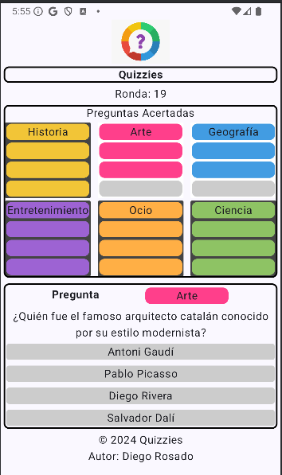

# AndroidClient

This project implements an Android client for the Quizies game.
It's using Android API 35.

## Description

From the User eXperience (UX), this project is trying to be as similiar as possible to the web client

Below you can find a screenshot of the android client.

  

## System Diagram

In order to better understand who the architecture of the system let's show a System Diagram.

  

## Authors

Contributors names and contact info

* [Profesor Diego Rosado](https://github.com/ProfesorDiegoRosado)

## Version History

* 0.1
    * Not released yet

## License

This project is licensed under the MIT License - see the [LICENSE.md](LICENSE.md) file for details
