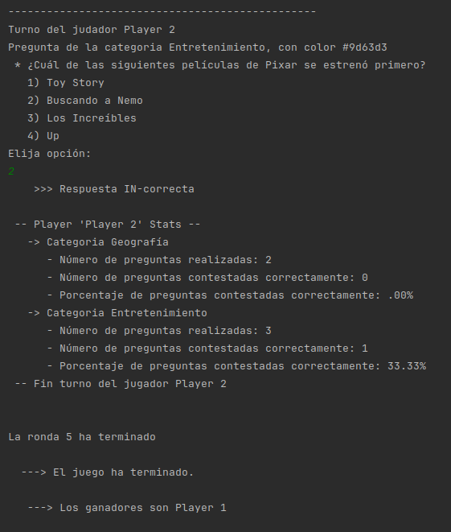
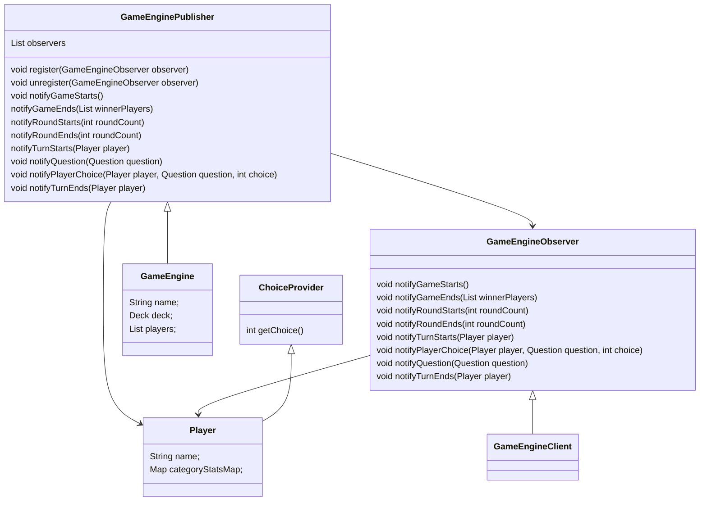

# GameEngine

The main goal of this project is to be used as library to deliver the Trivial Game experience to the clients.

<div align='center'>
  
</div>

This logo is under [CC license](https://thenounproject.com/icon/game-development-3216838/) 

## Description

This is a library to encapsulate game engine tasks.

The Game Engine will perform all common tasks to run the game and delegate in clients nuances of the game, like how to show the questions to the player. 

GameEngine Clients must implement the interface `GameEngineObserver` which will notify all game events. Players must implement `ChoiceProvider` interface which will notify which answer the Player has chose.

With these two interfaces we are decoupling the logic from the GameEngine and the Graphical interface and the players.

Example of a dummy GameEngine Client implementation screenshot below

<div align='center'>
  
</div>

## Data Model

Below you can find the UML class diagram of the data model of this project.



## Getting Started


### Dependencies

Dependencies so far:
- [QuizzEngine](https://github.com/ProfesorDiegoRosado/Quizies/tree/master/QuizzEngine)

### Installing

This project is intended to be used as a library for other projects.

### Testings

* Some JUnit tests are in place.
```
$ mvn test
```

## Authors

Contributors names and contact info

* [Profesor Diego Rosado](https://github.com/ProfesorDiegoRosado)


## Version History

* 0.1
    * Not released yet

## License

This project is licensed under the MIT License - see the [LICENSE.md](../LICENSE.md) file for details


