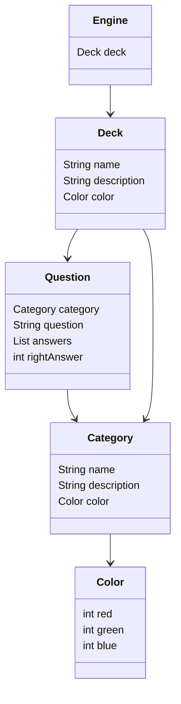

# QuizzEngine

The main goal of this project is to be used as library to deliver `Question`s to whatever app wants to use it.

<div align='center'>
  
</div>

## Description

This is a small library to encapsulate the question delivery task.

A `Question` is an object with the questions, with several posible answers and information about the right answer.

This library can be used for any purpose though it was created initially for a trivial game.

## Data Model

Below you can find the UML class diagram of the data model of this project.



## Data Loaders

As part of this project we will include `DataLoaders` which are class that will load the data from several storage backends.
The following data storage backends are planned:

 - [x] json files
 - [x] csv files
 - [x] xml files
 - [x] SQL database files
 - [ ] API REST service

## Getting Started


### Dependencies

Dependencies so far:
 - [Jackson](https://mvnrepository.com/artifact/com.fasterxml.jackson.core/jackson-core/2.17.2) -> to deal with json
 - [JDOM2](https://mvnrepository.com/artifact/org.jdom/jdom2/2.0.6) -> to deal with xml
 - [VARV](https://mvnrepository.com/artifact/io.vavr/vavr/0.10.4) -> to use Tuples in the source code
 - [SQLite JDBC](https://mvnrepository.com/artifact/org.xerial/sqlite-jdbc/3.46.0.1) -> to deal with SQLite

### Installing

This project is intended to be used as a library for other projects.

### Testings

* Some JUnit tests are in place.
```
$ mvn test
```

## Authors

Contributors names and contact info

* [Profesor Diego Rosado](https://github.com/ProfesorDiegoRosado)  


## Version History

* 0.1
    * Not released yet

## License

This project is licensed under the MIT License - see the [LICENSE.md](../LICENSE.md) file for details

