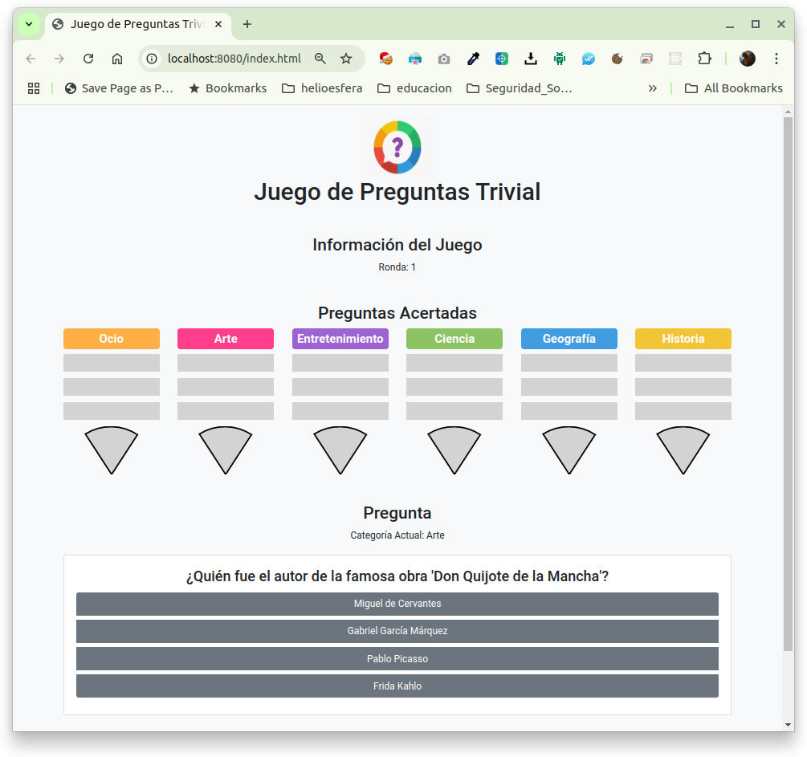
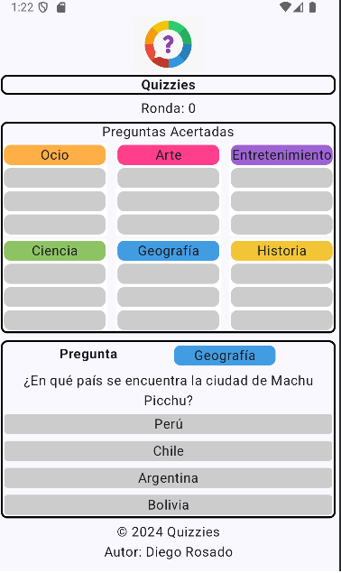

# Quizies

The goal of this whole project is to have a game where pupils can learn and have fun while doing it.
It's been thought to be a Trivial like question game. It also has in mind to be a flexible tool to be adapted to other scenarios. This is why there are several projects so the whole project is built from pieces that can be reused or adapted to other scenarios.

<div align='center'>
  
</div>

Note: Designed by Freepik


## Description

As commented, this project wants to be modular and flexible. That's why is built with subprojects.

There are several projects:
 * **[QuizzEngine](QuizzEngine)**: library to load questions from backend. Persistency options so far are: json (main/default option), csv, sqlite and xml files).
 * **[GameEngine](GameEngine)**: The engine to run the game. It's flexible enough to allow diferent kind of games but still pretty inmature.
 * **[chatGPTQuestions](chatGPTQuestions)**: this project was build to create the first batch of questions to work with. It's uploaded for educational purposes but it's not needed to run the game.
 * **[WebServer](WebServer)**: Spring Boot web server with STOMP protocol on top of web sockets.
   * **WebClient** -> Web client: Inside the WebServer project we have a small web client to start with and testing STOMP.
 * **[AndroidClient](AndroidClient)**: Android client on kotlin an using jetpack compose for the UI.


## System Diagram

In order to better understand who the architecture of the system let's show a System Diagram.

<div align='center'>
  
</div>


## Instalation

How do we start the installation?
To begin, we go to the code from the repository.
We can download it as a zip or clone the repository.

To clone the repository write the following

```console
$ git clone https://github.com/ProfesorDiegoRosado/Quizies.git
```

### Installing QuizzEngine
Now that we have downloaded the source code, we are going to create the libraries and upload them to the local maven repository.

We enter the Quizies/QuizzEngine folder

```console
$ cd Quizies/QuizzEngine
```

We execute the maven command to install the QuizzEngine library jar in the local maven repository

```console
$ mvn clean install
```

### Installing GameEngine
We already have our QuizzEngine jar installed in the local maven repository.
Let's go to the GameEngine subproject

```console
$ cd ../GameEngine
```

We run the maven command again to install the GameEngine jar library in the local repository

```console
$ mvn clean install
```

### Launching the WebServer
Once the GameEngine jar is installed in our local maven repository we go to the WebServer subproject.

```console
$ cd ../WebServer
```

We can launch the application with the command

```console
$ mvn clean spring-boot:run
```

This will run the server and wait for requests.
There are some logs so if we leave the terminal open we can see the messages that are received.

### Launching Web client

To test the web client, since we already have the web server launched, we just have to use a web browser and we will put the url: http://localhost:8080/index.html 

When launching the browser with said url we will see something similar to the following

<div align='center'>
  
</div>

Your are done!. Just enjoy the game.


### Launching Android client

To test the Android client at the moment we can only do it from the Android Studio development environment.
For them we open the project with Android Studio, select a device on which to test and execute.

When you run Android Studio, it launches an Android emulator on which the application will load and we will see something similar to the following

<div align='center'>
  
</div>

Again. Your are done!. Just enjoy the game.

## Authors

Contributors names and contact info

* [Profesor Diego Rosado](https://github.com/ProfesorDiegoRosado)  


## Version History

* 0.1
    * Not released yet

## License

This project is licensed under the MIT License - see the [LICENSE.md](LICENSE.md) file for details

