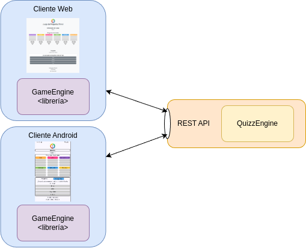
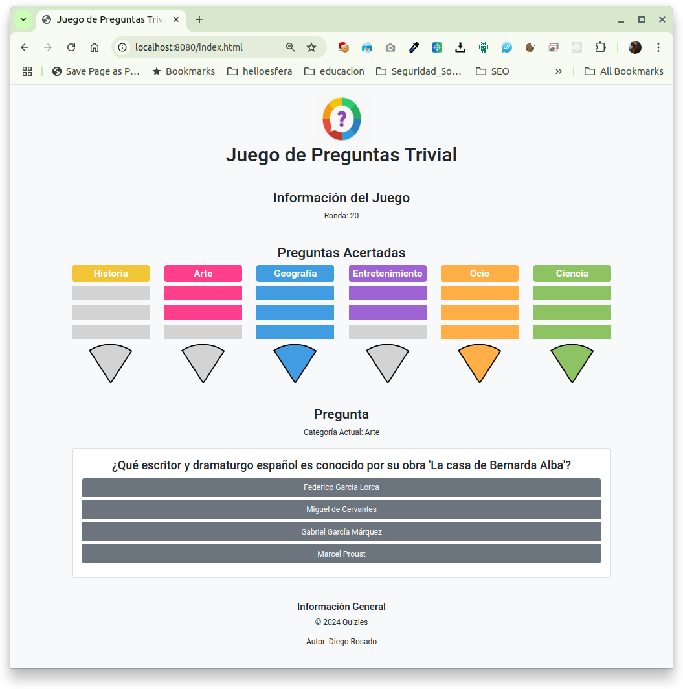

# WebServer

This project is a web server run using [Spring Boot](https://spring.io/projects/spring-boot/).
The server will serve the web client to play the trivial game.


## Description

This project will be the server of the system. It's a Spring Boot service with WebSocket connections to the clients.

To better understand the system architecture let's show a System Diagram.

<div align='center'>
  
</div>


## Getting Started


### Dependencies

Dependencies so far:
- [QuizzEngine](https://github.com/ProfesorDiegoRosado/Quizies/tree/master/QuizzEngine)
- [GameEngine](https://github.com/ProfesorDiegoRosado/Quizies/tree/master/GameEngine)

### Running the server

To run this project just execute the command below.

```
$ mvn spring-boot:run
```

### Running web client

The server will be run in the local host at 8080 port.
Accessing the url http://localhost:8080/index.html will start the web client.
You will see something similar to the screenshot below.

<div align='center'>
  
</div>


## Authors

Contributors names and contact info

* [Profesor Diego Rosado](https://github.com/ProfesorDiegoRosado)


## Version History

* 0.1
    * Not released yet

## License

This project is licensed under the MIT License - see the [LICENSE.md](../LICENSE.md) file for details


